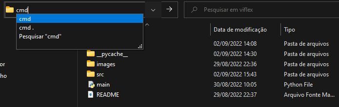

## Download videos and music from You Tube through your terminal

### Installation

> - Download the executable
> - Decompress the file
> - Put the folder address in [environment variable](https://knowledge.autodesk.com/pt-br/support/navisworks-products/troubleshooting/caas/sfdcarticles/sfdcarticles/PTB/Adding-folder-path-to-Windows-PATH-environment-variable.html) ``PATH`` (optional)
 
 ---
 
 ### How to use
 > - Open the terminal in the directory where you want to save the file
 > 
 >
 >
 > - Follow the following structure to download only the video
 >```
 >viflex -v "video link in quotes"
> ```
>
> - Follow the following structure to download only the audio
>```
>viflex -a "video link in quotes"
> ```
---
### Comments
> - Video will be automatically downloaded with best available quality
> - If you haven't put the folder address in the environment variable you can just run the commands in the same directory as the executable
> - If you omit the -v and -a parameters automatically, only the video will be downloaded
>```
>viflex "video link in quotes"
>```
