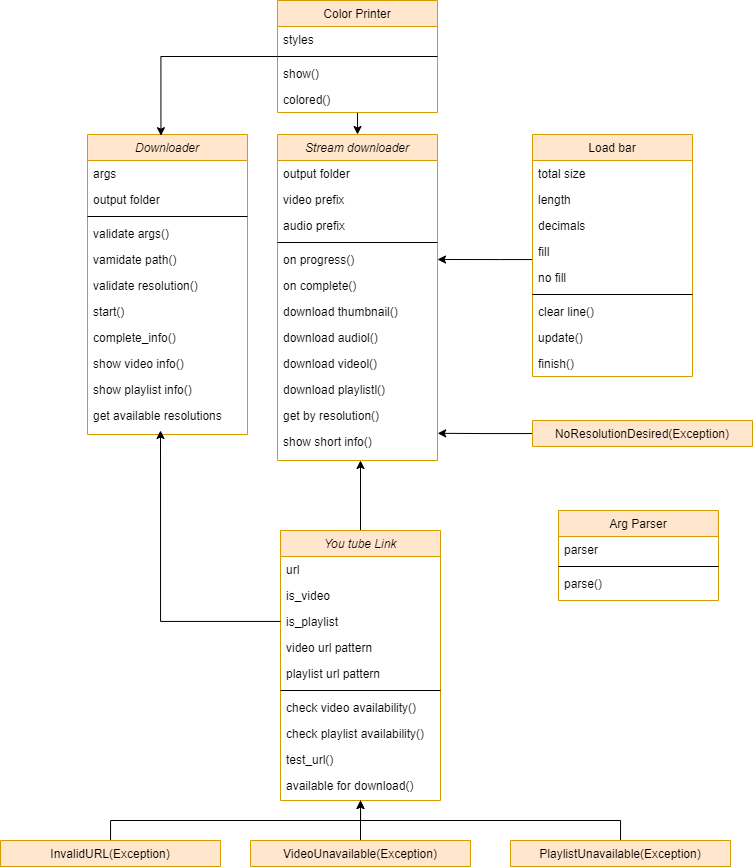

## Download videos and music from You Tube through your terminal

### Description

> Viflex is a cli app for youtube videos with several features, it can download playlist, audios and video covers. The focus is as objective as possible without having to take many steps to start your download directly in the desired folder, designed for video editors who need research and visuals or sound on youtube.
### Installation

> - Download the executable
> - Decompress the file
> - Put the folder address in environment variable ``PATH`` (optional)
 
 ---
 
 [environment variable](https://knowledge.autodesk.com/pt-br/support/navisworks-products/troubleshooting/caas/sfdcarticles/sfdcarticles/PTB/Adding-folder-path-to-Windows-PATH-environment-variable.html)
 ### How to use 
 > Recommended to put the exe file address in environment variable PATH, follow this tutorial
 > - [On Windows](https://knowledge.autodesk.com/pt-br/support/navisworks-products/troubleshooting/caas/sfdcarticles/sfdcarticles/PTB/Adding-folder-path-to-Windows-PATH-environment-variable.html) 
 > - [On Ubuntu](https://linuxhint.com/show-path-environment-variables/) 
 > 
 > Open the terminal in the directory where you want to save the file
 > 
 > On windows use this shortcut
 > 
 > 
 >
 > #### Features
 > 
 >
 > Viflex commands can be run like this
 >```
 > viflex "video url"  optional flags
 > ```
> or this format
>```
>viflex optional flags "video url"  
> ```
> #### All optional commands
> | short format |  long format | example arguments |                        help                       |
> |:------------:|:------------:|:-----------------:|:-------------------------------------------------:|
> |      -v      |    --video   |         --        | download only the video                           |
> |      -t      |  --thumbnail |         --        | download only the audio                           |
> |      -pl     | --playlist   |         --        | download all videos from playlist                 |
> |      -i      |    --info    |         --        | show detailed information about video or playlist |
> |      --      |   --version  |         --        | show de current version and exit                  |
> |      -h      |      --      |         --        | show help message and exit                        |
> |      -r      | --resolution |       1080p       | select video resolution                           |
> |      -p      |    --path    |     E:\videos     | select output folder                              |
> 
> #### Usage
> How to download a video
>```
>viflex -v "video url"  
> ```
> How to download audio from the video
>```
>viflex -a "video url"  
> ```
> How to download all videos from playlist, to download only the audio of the videos just change ``-v`` to ``-a``
>```
>viflex -v -pl "playlist url"  
> ```
> How to download the video thumbnail
>```
>viflex -t "video url"  
> ```
> How to download a video with a specific quality
>```
>viflex -v -r 2160p "video url"  
> ```
> #### Progressive vs Adaptive videos
> When you do not specify the video resolution, the best progressive resolution is chosen, the difference between progressive videos and adaptive videos is that in progressive videos the video and audio are contained in a single file while in adaptive videos they are separated, most progressive videos have only 720p and 360p resolutions, this means that when downloading video in 2160p (4k) the video and audio will be separated, joining the files is a functionality to be implemented
>
>#### Comments
> - If you haven't put the folder address in the environment variable you can just run the commands in the same directory as the executable
> 
--- 
### Project diagram
>
> 
